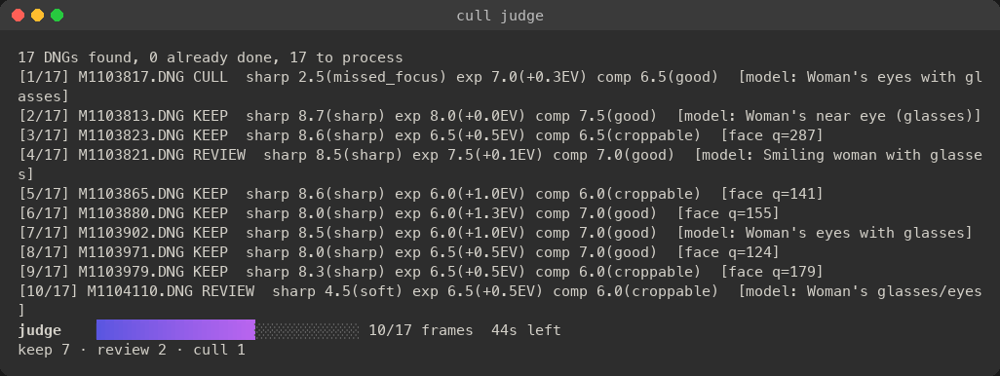
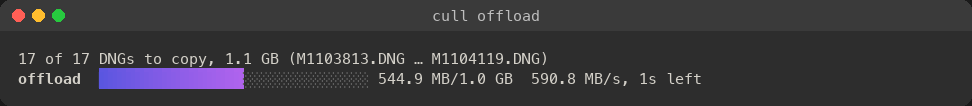

# cull

`cull` sorts a folder of DNG raw files into **keep**, **review** and **cull**. A vision
model assesses each frame's embedded JPEG preview, and deterministic Go rules make
the decision. Its priorities:

- **Sharpness gates.** A missed-focus or motion-blurred frame is culled.
- **Exposure gets fixed, not culled.** Fixable exposure only produces a suggested
  correction.
- **Composition gets cropped, never culled.** A weak composition only produces a
  suggested crop.

It also groups similar frames into sets and ranks each set side by side, so you keep
the best few of a sequence. Before any of that, it copies the card with every file
verified. Afterwards it sorts frames into folders and writes sidecars with keywords, for
Capture One or Lightroom.



For a whole session with real output at every step, from the card to Capture One, see
[USAGE.md](USAGE.md). Project site: **[code.jefflaplante.com/cull](https://code.jefflaplante.com/cull/)**, with a [usage walkthrough](https://code.jefflaplante.com/cull/usage.html).

- [Camera support](#camera-support)
- [Install](#install)
- [Quick start](#quick-start)
- [Commands](#commands)
- [How decisions are made](#how-decisions-are-made)
- [Sequences and best of set](#sequences-and-best-of-set)
- [Reviewing and labelling](#reviewing-and-labelling)
- [Model backends](#model-backends)
- [Cost control](#cost-control)
- [Output: sidecars, Capture One and moving culls](#output-sidecars-capture-one-and-moving-culls)
- [Flag reference](#flag-reference)
- [Limitations](#limitations)

## Camera support

`cull` never renders the raw data. It judges sharpness on the **JPEG preview embedded
in the DNG**, so a camera works only if its DNGs embed a large preview. Full
resolution is best: focus is judged on a crop at the preview's native resolution.
The brand doesn't matter; the camera's DNG writer does.

| Result | Cameras tested |
|---|---|
| **Works: full-resolution preview** | Leica M11-P, M10, M10-R, Q2, SL2, CL; Pentax K-1 Mark II, K-3 Mark III; Ricoh GR III; Sigma fp; Apple iPhone 12 Pro (ProRAW); Samsung Galaxy S23 Ultra; Adobe DNG Converter output with a full-size preview |
| **Usable: reduced preview** (2560 px, about a third of the sensor width) | Google Pixel 8 Pro. Focus is judged on less detail than the sensor recorded. |
| **Unreliable: small preview** (≤ 960 px, flagged "focus judgement unreliable") | Apple iPhone XS, Google Pixel 4a, DJI drones (Mini 2, Mavic 3 / Hasselblad L2D-20c) |
| **Doesn't work: no usable preview** | Leica M9 (320 px uncompressed thumbnail only), Leica M (Typ 240) and M Monochrom (Typ 246) (160 px thumbnail only), OnePlus 6T (no preview) |

Tested on 22 sample files from [raw.pixls.us](https://raw.pixls.us) with
`cull scan`, which extracts previews, EXIF and raw clipping without calling a model.

- **Check your own camera** with `cull scan <dir>`. It reports each preview's size,
  and flags any preview smaller than `--min-preview-edge` (1500 px). When the file's
  own structure yields nothing large enough, `cull` also tries `exiftool` if it's
  installed.
- **Workaround for cameras without a large preview:** convert the files with Adobe
  DNG Converter, with *JPEG Preview: Full Size*. That output embeds a full-resolution
  preview. This wasn't tested on the failing cameras above.
- **Raw highlight clipping** (see [How decisions are made](#how-decisions-are-made))
  needs a raw that is stored as **striped lossless JPEG**. That covers the Leica M10,
  M10-R, M11, M (Typ 240) and Monochrom (Typ 246), and the Pentax and Ricoh bodies
  tested. Other layouts (tiled, uncompressed, lossy DNG) fall back to judging clipping
  on the preview, which overstates it.
- **The prompts name each frame's camera** from its EXIF ("a Canon EOS 5D Mark III",
  "an Apple iPhone 12 Pro"). Leica M bodies are also described as manual-focus
  rangefinders, where missed focus is a common failure.

## Install

**Homebrew** (macOS):

```sh
brew install jefflaplante/tap/cull
```

**Pre-built for macOS** (one universal binary for Apple silicon and Intel), from the
[latest release](https://github.com/jefflaplante/cull/releases/latest):

```sh
curl -fsSL https://github.com/jefflaplante/cull/releases/latest/download/cull_macos_universal.tar.gz | tar -xz
sudo mv cull_macos_universal/cull /usr/local/bin/
cull version
```

Each release also has a `.sha256` file to check the download against.

**The binary isn't notarized by Apple.** Downloaded with `curl` as above, it runs as is.
Downloaded in a browser, macOS quarantines it ("cannot be opened"). Clear that once with
`xattr -d com.apple.quarantine cull`.

**From source** (Go 1.26+; Bubble Tea v2, the live progress view, needs it):

```sh
make build                                            # bin/cull, version stamped from git
make install                                          # $GOPATH/bin/cull
go install github.com/jefflaplante/cull/cmd/cull@latest
```

**Releases** are built by `.github/workflows/release.yml` when a `v*` tag is pushed:
1. A macOS runner runs vet and the tests, then `make dist`.
2. It publishes the release.
3. It updates `Formula/cull.rb` in
   [jefflaplante/homebrew-tap](https://github.com/jefflaplante/homebrew-tap), through a
   deploy key stored as the `TAP_DEPLOY_KEY` secret.

`make dist` also builds the same tarball locally.

- **Optional:** `exiftool`, which finds previews in unusual locations.
- **For the `claude-code` backend:** the `claude` CLI, logged in to your Claude
  subscription.
- **Name clash:** npm, crates.io and PyPI each have an unrelated package that installs
  a `cull` command, and npm's deletes files. If you have one of those installed, check
  that `which cull` is this one.

## Quick start

```sh
cull offload /Volumes/LEICA\ M ~/Pictures --name "Forest portraits"   # card → verified copy → free scan
S=~/Pictures/"2026-10-02 Forest portraits"   # the shoot folder offload created
cull judge --estimate "$S"                    # free: what judging would cost
cull judge "$S"                               # model assessment + decisions + set ranking; re-run to continue
cull review "$S"                              # browser: check, label keep/review/cull, add stars
cull decide --sort "$S"                       # keep/ review/ cull/ for import (sidecars are already written)
```

Everything is recorded in `cull-report.json` in the shoot folder. `cull restore "$S"`
undoes `--sort`.

**A real run, 17 frames:**

```
$ cull offload LEICA_M Pictures --name "Forest portraits" --location "Forest Park, Portland"
…
copied 17, skipped 0 (already there), failed 0: 1.1 GB in 2s (601 MB/s, verified)
all 17 files verified on Pictures/2025-12-28 Forest portraits: safe to format the card

$ cull judge --backend claude-code "Pictures/2025-12-28 Forest portraits"
…
[1/17] M1103817.DNG CULL  sharp 2.5(missed_focus) exp 7.0(+0.3EV) comp 6.5(good)  [model: Woman's eyes with glasses]
[3/17] M1103823.DNG KEEP  sharp 8.6(sharp) exp 6.5(+0.5EV) comp 6.5(croppable)  [face q=287]
…
ranked set 1 (2 frames): M1104115.DNG wins — … Sharpness at the eyes is the top priority, so Frame 2 wins narrowly.
results: map[cull:1 keep:14 review:2]

$ cull decide --sort "Pictures/2025-12-28 Forest portraits"
writing sidecars: 17 files
sorting frames into keep/, review/ and cull/: 17 frames
decided 17 frame(s); no decision changed; sorted 17 into keep/, review/ and cull/, 0 back into the shoot folder
```

Every step, with its full output and screenshots of the live progress view, is in
[USAGE.md](USAGE.md).

## Offload: card to shoot folder



`cull offload <card>... <dest>` copies every DNG on the cards into one folder per run,
`<dest>/<YYYY-MM-DD> <name>/`. It then scans that folder, which is free.

- **The cards are only read.** Nothing on them is written, renamed or deleted.
- **The folder date** comes from the earliest capture date. Camera clocks get set wrong,
  so the plan says which file it came from; use `--date` to set it yourself.
- **One folder per event, if you ask.** A card holding several events can go into one
  numbered shoot folder each (`2026-10-02 Smith wedding 1`, `… 2`), so each imports into
  Capture One or Lightroom as its own set. Each event folder gets its own manifest, scan
  and report.
  - `--split` starts a new event wherever capture time jumps by more than `--split-gap`
    (default 2h), or the day changes. It refuses a card whose clock wasn't running:
    nearly every frame stamped alike.
  - `--split-at M1103426,M1103838` starts an event at each named file instead, in camera
    order, whatever the clock says. `--dry-run` shows the events first.
  - Free space is checked for all events together.
- **Planned first.** Every name, skip and refusal is decided before any byte is written:
  - a file name already in the folder with different content is refused (use `--rename`);
  - too little free space on either destination is refused.

  `--dry-run` prints the plan and stops.
- **Verified copies.** The card is read once:
  - the SHA-256 is taken during that read, and the same read feeds `--backup` too;
  - each copy goes to a hidden temp file, is synced, dropped from the page cache, and read
    back from the disk;
  - only a matching copy gets its real name, and nothing existing is ever replaced;
  - a read or write error retries the file twice, then lists it as failed.
- **"Safe to format"** prints only when all of these hold:
  - every file is verified on every destination;
  - each drive's own write cache was flushed (`F_FULLFSYNC`);
  - no file was merely "already there" without ever being checked against the card. Use
    `--checksum` to check those.
- **Re-running is safe** after a pulled card or Ctrl-C. Only what's missing is copied:
  `cull-offload.jsonl` records each verified file. `--verify <folder>` re-checks copies
  later against those checksums, for example before formatting the next day.
- **`--rename "{date}_{name}_{n:4}"`** renames as it copies. Tokens: `{date}` (YYYYMMDD),
  `{name}`, `{orig}` (camera name), `{n}` and `{n:W}`. The counter continues from the
  folder's largest number, so a second card carries on from the first. Frames are
  numbered in camera file order, not by capture time.
- **Speed (measured on an M11-P card over USB):** the card reads at about 280 MB/s. A
  992-frame, 67.7 GB card went to a USB SSD in 8 minutes, every file verified; to the
  Mac's SSD, the measured 194 MB/s below would take about 6 minutes.

  `go test -tags cardbench -run CardBench ./internal/offload` compares the copy engine with
  the usual tools on the mounted card. Every read must come from the card, not RAM: each
  tool gets its own frames when the card has enough, and either way the frames' pages are
  evicted from the page cache before every run and checked gone (mincore). Set
  `CULL_BENCH_DST` for the destination; `CULL_BENCH_N` and `CULL_BENCH_ROUNDS` set frames
  per run and rounds (every second round runs the tools in reverse order).

  Results for 10 M11-P frames (602 MB), from one session on 2026-10-06: 3 rounds (1.8 GB per
  tool) to each destination. The card held only 10 frames, so every run copied the same ones,
  evicted first (a few runs still started with one frame cached). Each tool is timed until
  its data is durable: cull fsyncs every file and ends with F_FULLFSYNC (fsync on a network
  share), and the others end with `sync` plus an F_FULLFSYNC on the folder. The figure in
  brackets is the speed before that, which is when the tool returns. Finder itself wasn't
  timed.

  | MB/s | Mac SSD | USB SSD (exFAT) | NAS, SMB over 10 GbE |
  |---|---|---|---|
  | cull, every byte re-read and compared | 194 | 153 | 107 |
  | cull's older one-file-at-a-time engine, same check | 190 | 142 | 92 |
  | `ditto` (macOS's built-in copy command), no check | 104 (241) | 70 (213) | 59 (199) |
  | `cp`, no check | 76 (224) | 78 (215) | 54 (98) |
  | `rsync -a` (openrsync), no check | 80 (168) | 69 (129) | 47 (76) |

  cull reads the next file off the card while the last one is synced and verified; the older
  engine finished each file before reading the next. The 10 GbE column is a TrueNAS SMB
  share over a 10GBASE-T link with 0.4 ms round trips. On local disks and on the 10 GbE
  share, the verified copy is as fast as or faster than an unverified one once both are
  durable. The other tools' durable figures swing between sessions with how long `sync`
  takes: an earlier session the same day measured `ditto` at 147 MB/s to the Mac SSD.

  On a NAS, the verify re-read crosses the network. Over Wi-Fi (an earlier session, older
  engine only) cull managed 17 MB/s against `ditto`'s 40, `cp`'s 32 and `rsync`'s 21, and the
  re-read took 46% of its time; there, copy to the Mac first. Over 10 GbE the re-read took
  21% of the older engine's time.

  The 10 GbE share's limit is durable writes, not the network. A 2 GiB probe file over
  SMB measured:

  | Probe step | MB/s |
  |---|---|
  | buffered write | 749 |
  | write until fsync returned | 159 |
  | read back uncached | 829 |

## Your defaults: `~/.cull`

Flags you always type can go in a dotfile, `~/.cull`. Each line is a flag's name (without
the dashes), `=`, and its value. `#` starts a comment. Lines under a `[command]` header
apply to that command only; the lines above any header apply to every command that has
the flag.

```ini
# ~/.cull
backend = claude-code     # judge on your Claude subscription
keep-best = 3
outranked = cull

[review]
sort = all                # re-sort by your labels when the review server stops
```

Booleans take `true` or `false`. A repeatable flag (`keyword`) takes one line per value.
Quotes around a value are optional.

### Managing it

- **Create or edit it** with any text editor; there's nothing to install or register.
- **See what it changed:** every run that takes a value from it prints one line first,
  for example `defaults from /Users/you/.cull: --keep-best 3 --outranked cull`.
  `cull judge --estimate <dir>` is a free way to check without changing anything.
- **Turn it off for one run:** `CULL_CONFIG=/dev/null cull judge <dir>`.
- **Use another file:** `CULL_CONFIG=~/cull-weddings cull judge <dir>`. That's handy for
  different kinds of work, such as weddings and travel.
- **Mistakes are flagged, not ignored:**
  - a name no command has (a typo) prints a warning and is skipped;
  - a value that doesn't fit the flag (`keep-best = lots`) stops the command, naming the
    file and line;
  - a malformed line also stops the command.
- **What it can't set:** one-off and risky flags are refused with a warning, so you always
  type them on purpose: `yes`, `fresh`, `force`, `run`, `probe`, `verify`, `dry-run`,
  `estimate`, `prepare`, `clear-cache`, `rerank`, `overwrite-xmp`, `report`, `help`,
  `version`, and the verbosity flags `quiet`, `verbose`, `debug` and `log-level`.
- **Old keys still work, with a warning:** `write-xmp = false` means no sidecars,
  `move-culled = true` means `sort = culls`, `sort = true` means `sort = all` (write
  `sort = all`), and `resume` is ignored. If both `sort` and `move-culled` come from the
  file, `sort` wins.

### Precedence: which value wins

From strongest to weakest:

1. **A flag you type** on the command line always wins.
2. **The shoot's stored policy and backend** (`decide` and `judge`). The policy covers the
   decision rules and the set grouping: `keep-best`, `outranked`, `eyes-closed`, `raw-clipped`,
   `raw-clip-threshold`, `junk`, `review-below-sharpness`, `cull-max-sharpness`,
   `min-crop-area`, `seq-gap` and `seq-look`.
   - Every `judge`, `decide` and `review --sort` saves the full policy it used in the
     shoot's `cull-report.json`.
   - `decide`, `calibrate`, a continued `judge` and `review --sort` start from that stored
     policy, so tuning done on one shoot stays with it.
   - A continued `judge` also takes its backend, model and effort from the report.
3. **`~/.cull`**: a `[command]` section first, then the lines above any header.
4. **The built-in default.**

Some special cases:

| Situation | What happens |
|---|---|
| The first `cull judge` of a shoot | There's no stored policy yet: typed flags, then `~/.cull`, then the defaults. The result becomes the shoot's stored policy. |
| `cull judge` on a shoot that has a report | `--backend`, `--model` and `--effort` come from the report, not `~/.cull`, unless you type them. A set is ranked by the model that judged it. A typed flag that differs from the report's is refused, naming `--fresh` and `-o`. |
| `cull judge --fresh` | Replaces the report, so it judges with `--backend` (or `~/.cull`'s, or the default), not the replaced report's. |
| `~/.cull` says `keep-best = 3`, the shoot's report says 2 | `cull decide` uses 2, and the note `policy from the report: --keep-best 2` says so. Type `--keep-best 3` to change the shoot, which then stores 3. |
| You want a built-in default back on a tuned shoot | Type it: `cull decide --keep-best 3 <dir>`. Leaving a flag off keeps the stored value. |

To see a shoot's stored policy, look at `"policy"` and `"seq"` in its `cull-report.json`,
for example with `jq '.policy, .seq' cull-report.json`.

## Keywords and tags

Every judged frame gets up to 8 **content keywords** from the model, such as `portrait`,
`forest`, `red dress` or `laughing`. The model is asked for 3–8, and Go cleans them. Every frame also gets the **shoot's tags**:
- **Set them** with `--project`, `--event`, `--location` and `--keyword` (repeatable) on
  `offload`, or later with `cull tag`.
- **They're stored in the report,** so later runs keep them, including `judge --fresh`
  (tags describe the shoot). Flags given again replace them field by field.
- **Tags belong to the report,** not the folder: a run with `-o other.json` starts
  without them.
- **Values can't contain `|`** (it separates keyword levels) or start with `cull:`
  (cull's own markers).
- **`cull tag <dir>`** shows them or changes them (`--clear-location` and so on). The
  sidecars pick them up on the next `cull decide <dir>`, which rewrites them by default.

**Sidecars** carry them as plain keywords in `dc:subject` and as paths in
`lr:hierarchicalSubject`: `content|forest`, `project|Smith wedding`, `event|…`,
`location|…`. Capture One 16.7.2 nests them on import (checked), and so does Lightroom.

**`apply-c1 --keyword`** applies the same plain words to frames already in a catalog.
Capture One's scripting can't nest keywords.

**The review page** shows each frame's keywords and, in its header, the shoot's tags.
Junk frames get your tags but no content keywords, since the model never saw them.

## Commands

| Command | What it does | Calls a model |
|---|---|---|
| `offload <card>... <dest>` | Copy a card into a dated shoot folder, every file verified; then scan it (`--verify <folder>` re-checks later) | no |
| `scan <dir>` | Extract previews, EXIF, faces and look fingerprints, flag junk frames; write the report | no |
| `judge <dir>` | Assess every frame, decide keep/review/cull, then rank the sets; continues an existing report | yes |
| `decide <dir>` | Re-apply the policy to stored assessments; regroup sets; rewrite sidecars; sort into keep/ review/ cull/ (`--sort`) or only culls into cull/ (`--sort=culls`) | no |
| `review <dir>` | Browser contact sheet for checking, labelling and rating frames | no |
| `calibrate <report>...` | Compare a report's decisions with your labels; print a grid of policy settings | no |
| `apply-c1 <dir>` | AppleScript that applies verdicts, stars and keywords in Capture One (dry run by default) | no |
| `tag <dir>` | Show or change the shoot's project, event, location and keywords | no |
| `restore <dir>` | Move frames that `--sort` moved back where they were | no |
| `status <dir>` | Where a shoot stands (judged, labelled, ranked, spent) and the next command to run | no |
| `version`, `completion` | Build version; shell completion | no |

Every command has `--help`, which shows the flags in sections (Flags, Policy, Backend,
Sidecar and folder) with examples. `--help-all` also lists the Tuning and Experimental
flags. The v0.1 commands that v0.2.0 folded into others still run, with a warning; see
[Changed in v0.2.0](#changed-in-v020).

## How decisions are made

For each DNG:

1. **Preview.** The largest embedded JPEG preview is read directly from the file's
   TIFF structure; the raw data isn't read for this. EXIF orientation is applied.
   **Junk frames** are set aside here, with no model call and no cost: near-black (≥ 98%
   of pixels), blown white (≥ 95%), or uniform (thumbnail contrast below 3), such as a
   lens cap, a flash misfire, or a blank frame. `--junk` decides them (default cull;
   `review`, or `ignore` to judge them anyway). The thresholds come from 992 real frames:
   the darkest real frame was 74% near-black, the brightest 82% blown, and the flattest
   (low-key portraits in shade) had contrast 10. A filter on fine detail was tried and
   dropped, because sharp shallow-focus portraits have the least fine detail of all.
   Motion-blurred or pocket shots with some contrast left still go to the model.
2. **Focus target.** Face detection ([pigo](https://github.com/esimov/pigo)) finds the
   subject, centred on the eyes. With no confident face (`--face-min-q`, default 80),
   `judge` asks the model to locate the intended focus target (`--locate off` to skip).
3. **Assessment.** The model receives:
   - the full frame, downscaled to `--max-edge` (1024 px; it is context only);
   - the subject cropped at native resolution;
   - when there's no subject crop, a "where focus landed" tile (`--tiles`).

   It returns structured scores for sharpness, exposure, composition, and people
   (eyes, expression). Every answer is checked against a JSON Schema, with one retry.
4. **Decision in Go** (`eval.Policy`). The model only assesses; these rules decide:
   - `missed_focus` or `motion_blur` → **cull**, when the sharpness score agrees (at
     most `--cull-max-sharpness`, default 2.9, the top of the band the prompt gives those
     statuses; a higher score sends it to **review**);
     `soft` → **review**. Optionally,
     sharpness below `--review-below-sharpness` → review.
   - Closed eyes → `--eyes-closed` (default review).
   - Raw highlight clipping at or above `--raw-clip-threshold` → `--raw-clipped`
     (default review). When the raw shows headroom, a "clipped" preview isn't held
     against the frame.
   - Composition never culls. A suggested crop is dropped if it keeps less than
     `--min-crop-area` of the frame.
   - Frames ranked below `--keep-best` in their set → `--outranked` (default review).
5. **Report.** `cull-report.json` is the source of truth: assessments, decisions,
   reasons, sets, cost, and the policy used. It is checkpointed as `judge` runs, and
   running `judge` again skips files already done. `jq` works on it, e.g.
   `jq '.results[] | select(.decision=="cull") | .file' cull-report.json`.

## Sequences and best of set

Similar frames (the same subject or scene over seconds to minutes) are grouped into
**sets**. Each set is ranked by one side-by-side model call, and Go keeps the best few.

**Grouping.** Frames are ordered by capture time, then file name. A frame joins the
previous frame's set when both hold:

- **Time:** it was taken within `--seq-gap` (default 60 s) of the previous frame. The
  gap is ignored when either frame has no capture time. `--seq-gap 0` turns grouping
  off.
- **Look:** its look distance to the previous frame is at most `--seq-look` (default
  0.08). The look is an 8×8 colour grid of the preview, levelled for exposure and
  compared over small shifts. Small reframing and exposure changes stay close; a new
  scene or subject doesn't.

A set holds at most 40 frames. At the default threshold, only nearly identical
framings link, so retakes of a pose after reframing usually form separate sets. Raise
`--seq-look` to group more loosely.

**Ranking.** Each frame is sent as a 768 px full frame plus its subject crop, with no
file names and no scores. The rubric, in order:

1. subject sharpness where it matters (the eyes);
2. eyes and expression;
3. gesture and moment;
4. composition and background, judged on the full frame;
5. exposure only if it can't be fixed.

A set of more than 8 frames is split into chunks of at most 8. The top frames of each
chunk then meet in one final call; a 40-frame set takes 6 calls. Frames that failed
the sharpness gate stay in the set but aren't ranked.

**Ranking twice (`--rank-twice`, on `judge`; experimental, so only in `--help-all`).** Models favour some positions
in a list. With this flag, each set of up to 8 frames is ranked a second time with its
frames shown in reverse, which doubles those calls.
- A frame inside `--keep-best` in both orders is best.
- A frame outside it in both orders is outranked.
- A frame the two orders disagree on is disputed: a keep goes to review (unless
  `--outranked ignore`), and it isn't marked best.
- Sets already ranked once are re-ranked only with `--rerank`.

**Keeping the best.**
- `--keep-best` (default 3, range 0–5; 0 ranks without demoting) sets how many of
  each set stay keep. The rest get `--outranked` (`ignore`, `review` or `cull`;
  default `review`).
- Ranking only demotes keep; it never promotes a frame.
- A set that isn't ranked (`--no-rank`, a failed call, the cost limit) is ordered by
  the frames' own scores instead, and the reason says so. The next `judge` run ranks it.
- The best frames get the keyword `cull:best`.

**Reuse.** A set's ranking is reused, with no new call, while every rankable frame in
it is still covered. A frame dropping out keeps the order; a new frame makes the set
unranked until the next `cull judge`. `cull decide` regroups and re-applies stored
rankings for free, so changing `--keep-best` or `--outranked` costs nothing.
The report also stores the grouping (`--seq-gap`, `--seq-look`): later `decide`
and `judge` runs regroup with it unless you type those flags again.
Regrouping can lose rankings:
- when two ranked sets merge, only the first one's order is kept;
- `--seq-gap 0` drops them all.

A split set keeps its order. What was paid always stays in the report's cost total.

**Re-ranking.** Ranking happens at the end of every `judge` run, for the sets that have no
current ranking, so a plain re-run also ranks sets that new frames joined.
- `cull judge --rerank <dir>` ranks every set again, even ones the model already ranked.
  Use it after re-judging frames or changing the grouping. A policy change alone needs
  only `cull decide`, which is free.
- `--no-rank` skips ranking for one run; the next run ranks.
- `cull judge --estimate <dir>` gives the exact call count once a scan has found the sets,
  and `--batch` runs the ranking at half price.
- A continued run uses the backend and model the report was judged with, unless you
  type others. `--batch` implies anthropic.
- An interrupted `--batch` ranking leaves `cull-report.json.rank-batch.json`.
  Running `cull judge --batch` again re-attaches without paying twice; deleting the file
  abandons it.

## Reviewing and labelling

`cull review <dir>` builds a contact sheet and serves it on `127.0.0.1`, with a
per-session token, then opens your browser.
- **Saving:** every change is saved at once, to `cull-labels.jsonl` beside the report
  and to the frame's XMP sidecar.
- **Other modes:** `--no-xmp` saves only the labels log.
- **Files don't move while you review.** A label change rewrites only the labels log and
  the frame's sidecar, where the frame is now: a frame you rescue from `cull/` stays in
  `cull/` with a green label. To move frames into the folders that match your labels:
  - run `cull decide --sort <dir>` after the session; or
  - start the session with `cull review --sort <dir>` (`--sort=culls` moves only culls),
    which re-sorts once when you stop
    the server with Ctrl-C. If the server ends any other way (the terminal is closed, the
    process is killed), nothing moves; run `cull decide --sort` yourself.

  **Don't re-sort once `keep/` and `review/` are imported** into Capture One or
  Lightroom: they lose track of files that move under them. After import, push your
  changes in with `cull apply-c1` instead.

| Key | Action |
|---|---|
| ← → | previous / next frame |
| ↑ ↓ | one grid row (one frame in the detail view) |
| Enter / Esc | open the detail view / back to the grid |
| K / R / C | label keep / review / cull (in the detail view, then advance) |
| U | clear the label |
| 1–5 / 0 | set stars / clear them |
| Z | 100% view of the whole frame, opened on the subject; drag or arrow keys pan |
| S | compare the frame's set side by side at one scale; 1–9 keeps that frame |
| N | next unlabelled frame |
| [ / ] | previous / next set |
| - / = | one keeper fewer / more in the frame's set (top N by the model's rank keep, the rest cull) |
| , / . | exposure −/+0.1 EV (< / > for ±0.5; \ resets): previewed on the page, applied in Capture One by `apply-c1 --exposure` |

**Filters** combine three rows:
- **Verdict:** your label, else the model's.
- **Progress:** unlabelled, unrated, and where you disagree with the model.
- **Sets:** all, keepers (frames in a group that you or the model keep), outranked.

For example, *Keep + Unrated* shows the keepers you haven't starred yet.

**Sets in the grid.** Each set is drawn as one box around its frames, with a header
showing how many keepers it has, and **−** / **+** buttons (or **-** / **=**) to change
that number. Changing it labels the set's top N frames, by the model's rank, as keep and
the rest of its ranked frames as cull. These are your labels, so sidecars,
`decide --sort`, `apply-c1` and `calibrate` all follow them. Each frame in a set
also has a **✓ keeper** toggle that flips just that frame between keep and cull.
Keepers have a green border.

**On each card and in the detail view:**
- Your label is the outlined badge, top right; the model's verdict is in the card's
  bottom row.
- A frame in a group shows "group_N · #rank/of": groups are numbered 1, 2, … through
  the shoot, and the rank is the model's.
- The detail view shows the model's reasons, the frame's rank with its strengths and
  weaknesses, and a filmstrip of its set.

**The labels log** is append-only; the last line for a file wins:

```jsonl
{"file":"L1000123.DNG","label":"keep","stars":4,"at":"2026-09-27T20:14:09-07:00"}
```

Your labels never change the report's decisions: the report stays the model's
record. Everything that writes sidecars or moves files uses them by default, so your
verdict wins and your stars become the rating. That covers `decide`, `apply-c1`, and
`judge` with `--sort`. `--labels <path>` reads the log from somewhere
else; `--no-labels` ignores it. `calibrate` reads the same log.

**Calibrating.**
1. Label a sample in `review`.
2. Run `cull calibrate <dir>` (or a report path). It reports:
   - the false-cull rate (you kept, it culled) and missed-cull rate;
   - the review rate;
   - a grid of policy settings, below.
3. For stability, judge the same frames twice (`-o run1.json`, `-o run2.json`) and run
   `cull calibrate --compare run1.json run2.json`. It counts decision flips, keep↔cull
   crossings and sharpness status changes, and needs no labels.
4. Apply the settings you pick with `cull decide`. The report stores that policy, so
   later `decide`, `calibrate` and `judge` runs start from it. A flag you type overrides
   only its own setting.

**The grid.** `cull calibrate` re-applies your labels to the report under 20 policy
settings and prints a row for each: `--keep-best` 1–5, `--outranked` review or cull, and
`--raw-clipped` review or ignore. Each row gives the false culls (count and percent of
your keeps), the culls caught, the culls missed and the review rate. `*` marks the rows
under 1% false culls, and the row for the report's current policy says `← current`. Pick a
row, then apply it with `cull decide --keep-best 3 --outranked cull <dir>`. It costs
nothing, but the grid is measured on the frames you labelled: confirm a row on the next
labelled shoot before relying on it.

## Model backends

| `--backend` | Default model | Auth and billing |
|---|---|---|
| `anthropic` (default) | `claude-sonnet-5-5` | API key, billed per token. Looked up in `--api-key-file`, `$ANTHROPIC_API_KEY`, `~/.anthropic/api_key`, `~/.config/anthropic/api_key`, `~/.anthropic_api_key` |
| `claude-code` | `sonnet` | Your Claude subscription, via `claude -p`. Never uses an API key. Stops at `--quota-stop` (default 0.9 of the 5-hour or 7-day window); run `judge` again later to continue |
| `openai` | required (`--model`) | Any OpenAI-compatible server at `--base-url` (default `http://127.0.0.1:8000/v1`); key optional. Streams, and stops as soon as the JSON is complete |

- A model missing from `cull`'s price table is refused with `--max-cost` (it would count as $0), and warned about otherwise.
- A continued `judge` refuses a different backend or model than the report's, naming
  `--fresh` and `-o`. Use `-o` to keep one report per backend when comparing them.
- `--escalate-backend` / `--escalate-model` re-assess doubtful frames on a stronger
  model; `--escalate-on` picks the outcomes that escalate. When the two models
  disagree on whether a frame failed (one says sharp, the other missed focus), it goes
  to review instead of trusting either.
- Small local vision models judge focus poorly. Calibrate before trusting one.

## Cost control

- `judge --estimate` prints the cost without calling a model or needing a key.
  - After a scan (or an earlier judge) found the sets, the ranking part counts their real
    calls: `ranking ≈ N call(s) for M set(s) already found`. It is an upper bound, because
    frames judged cull leave their sets.
  - Without a scan, it assumes every frame is in an 8-frame set, which usually
    overestimates.
- On a terminal, `judge` asks before spending when the estimate is over $1.
  `--yes` skips the question; scripts (no terminal) aren't asked.
- `--max-cost USD` stops the run once it has spent that much. Run the same command again to continue
  (without `--fresh`, which would start over).
- Re-running `judge` continues the report: frames already judged cost nothing. To replace
  a report that holds assessments, use `--fresh` (on `judge` and `scan`); `-o` writes a
  separate report. Even `--fresh` is refused while the report records frames moved out
  of the shoot folder by `--sort`.
- `--batch` (anthropic) uses the Message Batches API: half price, with results within
  minutes to hours. Ctrl-C is safe; run the same command again to re-attach to batches already paid for.
- Costs so far are recorded in the report; `judge` prints them when it finishes.
- On the API the system prompt is cached, so frames after the first read it at a
  tenth of the input price. The report's cost includes cache writes (1.25× input) and
  reads.

### Cost experiments

Two levers can cut cost, but could also change verdicts, so they were measured first:
- **`--effort low`** (or `medium`), with **`--locate-effort`** for the locate call. Output
  is about 40% of a frame's cost.
- **`--max-edge`**: now 1024 by default, after this A/B (16% fewer input tokens,
  verdicts within run-to-run noise on 17 frames). `--max-edge 1568` restores the old size.

```sh
cull judge -o base.json ~/Pictures/shoot
cull judge --effort low -o low.json ~/Pictures/shoot
cull calibrate --compare base.json low.json
```

Adopt a lever only if `--compare` shows no keep↔cull crossings, and labels agree. On
`--backend claude-code` these runs cost quota, not money. The report records the
effort, and a continued run refuses a different one.

## Output: sidecars, Capture One and sorting

**XMP sidecars** (`L1000123.xmp` beside `L1000123.DNG`) are written by default:
- by `judge` and `decide`, which keep cull's own sidecars current and create missing ones;
- by `review`, as you label.

`--no-xmp` turns them off. Sidecars that `cull` didn't write are never overwritten without
`--overwrite-xmp`.

| Field | Value |
|---|---|
| Rating | your stars only; left out when you haven't rated (the model never sets stars) |
| Label | the verdict (yours if you labelled, else the model's): keep **Green**, review **Yellow**, cull **Red** |
| Keywords | `cull:<verdict>`; `cull:labeled` when the verdict is yours; `cull:best` for a set's best frames |

Sidecars carry no exposure or crop: Capture One 16.7.2 ignores `crs:` develop settings in
a sidecar on import (tested). Use `apply-c1 --exposure --crop` to set them.

| Target | Rating, label, keywords | Exposure, crop |
|---|---|---|
| Capture One, from sidecars | read on import; use Image › Sync Metadata after import | not applied |
| Capture One, via `apply-c1` | yes | yes, with `--exposure` / `--crop`, only over default exposure and crop |
| Lightroom Classic | ignores sidecars for DNG files | — |

**Exposure from review.** Set a frame's exposure in the review page (the slider in the
detail view, or `,` `.` `<` `>`). The page previews it from the camera JPEG, and it's
saved with your labels. `apply-c1 --exposure` sets it in Capture One. Your EV always
overwrites Capture One's exposure, while the model's suggestion applies only where it is
still 0.

**`apply-c1`** writes an AppleScript for the open Capture One document. Run
`--probe` first (read-only), read the dry-run output, then use `--run` to apply it.

**Sorting for import.** `--sort` (on `judge`, `decide` or `review`) moves every judged
frame, and its sidecar, into `keep/`, `review/` or `cull/` beside it, by its verdict (your
label first).
- **Culls only:** `--sort=culls` moves just the culls, into `cull/`. Write it with the
  `=`: `--sort culls <dir>` is an error, since `culls` would read as the folder.
- **Then import** `keep/` and `review/` into Capture One, Lightroom or anything else. No
  sidecar support is needed for that split.
- **Re-sorting:** run `decide --sort` again after changing labels in `review`, and frames
  move between the folders.
- **Do it before importing:** the catalog loses track of frames moved afterwards.
- **Safety:** moves are same-disk renames that never overwrite, and each is recorded in
  the report. Frames that failed stay where they are. `cull restore` undoes it.
- **Older shoots:** frames an earlier version put in a `culled` folder move to `cull/` on the next
  sort, and `restore` brings back both. Later runs skip all of these folders.
- Look through `cull/` before deleting anything.

## Flag reference

`cull <command> --help` shows a command's flags in sections; `--help-all` adds the Tuning
and Experimental ones. This reference follows the same sections. Defaults are in
parentheses.

**Global** (every command): `-o/--report` sets the report path; `-r/--recursive`
includes subfolders. With `judge` and `decide`, an `-o` other than `<dir>/cull-report.json`
leaves the shoot's sidecars alone unless you type `--no-xmp=false`.

**Verbosity** (every command): `-q/--quiet` prints only warnings, errors and the final
summary; the default adds progress and a line per frame; `-v/--verbose` adds per-stage
and per-call detail; `--debug` adds backend events and raw model answers (never
credentials). `--log-level quiet|normal|verbose|debug` is the long form. `--plain` turns
off the live view.

On an interactive terminal, `scan` and `judge` show a live view: a progress bar
per stage with an ETA, keep/review/cull tallies, spend and any warnings, with each
frame's line printed above it. Piped or redirected output (and `--plain`, and `-q`) stays
plain lines. Ctrl-C works as before: in-flight frames finish, the report is saved.

### `judge`

**Flags**
- `--backend` (`anthropic`), `-m/--model`, `-j/--concurrency` (0 = the backend's default).
- `--estimate`: print the cost and exit.
- `--max-cost USD` (0 = no limit): stop once this run has cost that much.
- `--batch`: Message Batches API, half price (anthropic).
- `--yes`: don't ask before spending.
- `--fresh`: replace an existing report that holds assessments, judging with `--backend`
  (or `~/.cull`'s, or the default), not the report's. The default is to continue it.
- `--rerank`: rank every set again, even ones the model already ranked.
- `--sort [=all|culls]`: move judged frames (with their sidecars) into `keep/` `review/`
  `cull/`, or with `--sort=culls` only culls into `cull/`.

**Policy** (stored in the report; also on `decide` and `calibrate`; `--seq-gap` and
`--seq-look` also on `scan`)
- `--keep-best` (3; 0–5): per set, how many best-ranked frames keep their decision;
  0 ranks without demoting.
- `--outranked` (`review`): `ignore`, `review` or `cull`, for frames ranked below
  `--keep-best`.
- `--eyes-closed` (`review`) and `--raw-clipped` (`review`): `ignore`, `review` or `cull`.
- `--raw-clip-threshold` (0.5): percent of raw samples at the white level that counts
  as clipped.
- `--junk` (`cull`): `cull`, `review` or `ignore` for blank frames, decided without a
  model call.
  - **Changing it:** `decide --junk review` (or `cull`) re-decides junk frames for free
    and rewrites their sidecars. `decide --junk ignore` takes back a junk cull and leaves
    the frame unjudged; `judge --junk ignore` then has the model judge it.
  - **The thresholds come from one photographer's outdoor work.** A night sky, a concert or
    white-seamless product frames could cross them. `calibrate` lists any junk frame you
    labelled keep: check it on a new kind of shoot.
  - **Cost estimates** count every DNG, because junk is only found while frames are read.
    Junk frames are never charged.
- `--cull-max-sharpness` (2.9; 0 = the status alone culls).
- `--review-below-sharpness` (0 = off).
- `--min-crop-area` (0.6).
- `--seq-gap` (60 s; 0 = no grouping) and `--seq-look` (0.08).

**Backend**
- `--effort`: `low`, `medium`, `high`, `xhigh` or `max` (the model's own); recorded in
  the report.
- `--quota-stop` (0.9): claude-code stops at this fraction of the 5-hour or 7-day window.
- `--api-key-file`; `--base-url` (`http://127.0.0.1:8000/v1`) and `--openai-key-file` for
  the openai backend.

**Sidecar and folder** (also on `decide` and `review`)
- `--no-xmp`: write no sidecars.
- `--overwrite-xmp`: overwrite sidecars cull didn't write.
- `--labels <path>`, `--no-labels`: where your labels log is, or ignore it.

**Tuning** (`--help-all`)
- `--checkpoint` (25): save the report every N results.
- `--locate model|off` (`model`), `--locate-effort`.
- `--max-edge` (1024): long edge of the full frame sent to the model. It was 1568 before
  2026-10-01; 1024 cut input tokens by 16% with verdicts unchanged.
- `--min-preview-edge` (1500): preview size below which a frame is flagged.
- `--face-min-q` (80): face-detection confidence needed.
- `--tiles` (1): "where focus landed" tiles to send.
- `--raw-clip` (on): measure highlight clipping in the raw data.
- `--no-rank`: skip ranking this run.
- `--no-review-images`: don't pre-render the review sheet's images.
- `--save-inputs <dir>`: write exactly what the model sees.
- `--batch-poll` (30s), `--claude-bin`, `--openai-stream` (on).

**Experimental** (`--help-all`; not yet measured against labels)
- `--escalate-backend`, `--escalate-model`, `--escalate-on`: re-assess doubtful frames on
  a stronger model.
- `--second-opinion`: ask the model again about soft-or-worse frames; when the two answers
  disagree on whether the frame failed, it goes to review. Not with `--batch`.
- `--rank-twice`: rank each set of up to 8 frames again with its frames reversed.
- `--landed-with-subject`: send "where focus landed" tiles even with a subject crop.

### `scan`

`--fresh`, `-j/--concurrency` (4), `--raw-clip` (off here), `--save-inputs`; Policy
`--seq-gap` and `--seq-look`; Tuning `--face-min-q`, `--max-edge`, `--min-preview-edge`,
`--tiles`, `--no-review-images`; Experimental `--landed-with-subject`.

### `decide`

`--sort [=all|culls]`; every Policy flag above; Sidecar and folder `--no-xmp`,
`--overwrite-xmp`, `--labels`, `--no-labels`. It rewrites cull's own sidecars by default.

### `review`

`--sort [=all|culls]` (re-sort when the server stops), `--no-open`, `--prepare`,
`--clear-cache`; Sidecar and folder `--no-xmp`, `--overwrite-xmp`, `--labels`; Tuning
`-j/--concurrency` (8), `--force`, `--out`, `--port`.

### `calibrate`

`--compare`, `--labels`, and the Policy flags, which set the row marked `← current`.

### `offload`, `tag`, `status`, `restore`, `apply-c1`

- `offload`: `--name`, `--date`, `--backup`, `--rename`, `--split`, `--split-gap`,
  `--split-at`, `--dry-run`, `--verify`, `--no-scan`, `--checksum`, and the shoot's tags
  `--project`, `--event`, `--location`, `--keyword`.
- `tag`: the same four tag flags, and `--clear-project`, `--clear-event`,
  `--clear-location`, `--clear-keywords`.
- `status`: `--labels`. `restore`: no flags.
- `apply-c1`: `--probe`, `--run`, `--exposure`, `--crop`, `--rating`, `--label`,
  `--keyword`, `--labels`, `--no-labels`, `--osascript`.

## Changed in v0.2.0

<!-- v0.2.0 renames -->
For v0.1 users. Every old form below still works in v0.2.0, with a warning, and goes in
the next release, except the `calibrate` sweep, which the policy grid replaced.

| Old | New |
|---|---|
| `judge --resume …` | `judge …` (re-run continues) |
| `--fresh` | still replaces the existing report; `judge` continues one by default |
| `cull rank <dir>` | `cull judge <dir>` (ranks what needs it) |
| `cull rank --force` | `cull judge --rerank` |
| `cull rank --batch` | `cull judge --batch` |
| `--move-culled`, `culled/` | `--sort=culls`, `cull/` |
| `--write-xmp` | nothing (sidecars are the default); `--no-xmp` turns them off |
| `decide --write-xmp --move-culled` | `decide --sort=culls` |
| `--xmp-develop` | dropped: Capture One ignores it; use `apply-c1 --exposure --crop` |
| tag flags on `scan` and `judge` | on `offload`, or `cull tag` |
| `review --static` and `import-labels` | dropped: the served review only |
| the `--review-below-sharpness` sweep in `calibrate` | the policy grid |
| "`--help` lists every flag" | `--help` shows sections; `--help-all` shows everything |
<!-- /v0.2.0 renames -->

## Limitations

- **Calibrate before trusting it at scale.** Model verdicts vary between runs on
  borderline frames. Keep culls going to review until `calibrate` on your own labels
  shows an acceptable false-cull rate.
- **Ranking quality and stability** are not yet measured beyond a few sets.
- **Grouping** links nearly identical framings only; reframed retakes of one pose
  form separate sets.
- **Capture One:** `apply-c1` assumes Capture One's colour-tag numbering (1 red,
  3 yellow, 4 green) and image naming; confirm with `--probe`.
- **Crop coordinates** in `crs:Crop*` for rotated images follow the stored
  orientation. This hasn't been verified in Adobe tools, and `crs:CropAngle` isn't
  written.
