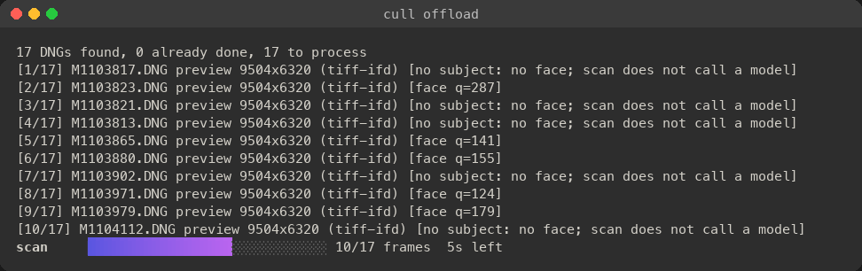
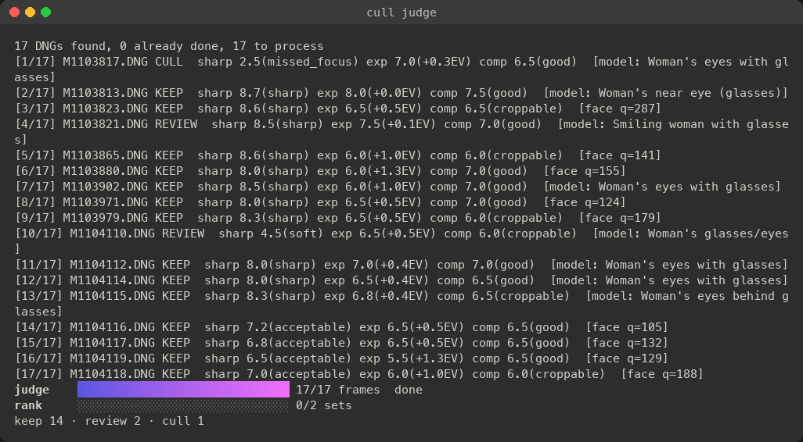

# Using `cull`: from the card to Capture One

This is a whole session, in order: copy the card, judge the frames, check them, then
import into Capture One. Every command has `--help` with examples; `--help-all` adds the tuning and experimental flags. The full flag
reference is in the [README](README.md).

**Every example here is real output** (the judge run recorded 2026-10-03; offload, estimate, tag, sort and status re-run with v0.2.0 on 2026-10-06), except `--set-date`, `redate` and `rename`, which show commands only until real output is added (the screenshots are rendered
from recordings of the live terminal). It's a 17-frame M11-P shoot: a small card made
from the repo's sample frames, judged with `--backend claude-code`. Paths are relative
to where the commands ran. Your numbers will differ. Lines are trimmed only where the
text says so.

## 0. Setup (once)

**Homebrew:** `brew install jefflaplante/tap/cull`

**Pre-built for macOS** (one universal binary for Apple silicon and Intel):

```sh
curl -fsSL https://github.com/jefflaplante/cull/releases/latest/download/cull_macos_universal.tar.gz | tar -xz
sudo mv cull_macos_universal/cull /usr/local/bin/
```

**From source** (Go 1.26 or newer):

```sh
make build      # bin/cull
make install    # optional: $GOPATH/bin/cull, so `cull` is on your PATH
```
 Judging needs one of these:

| Backend | How it authenticates |
|---|---|
| **API** (default) | Reads `~/.anthropic/api_key`, `$ANTHROPIC_API_KEY`, or `--api-key-file`. |
| **Subscription** (`--backend claude-code`) | Uses your Claude login through the `claude` CLI, so no key is needed. |
| **Local** (`--backend openai --model <name>`) | Any OpenAI-compatible server. It's free, but small models judge poorly. |

**Your defaults (optional).** Flags you'd type on every run can go in `~/.cull`, one
`name = value` per line. A `[command]` section applies to that command only:

```ini
backend = claude-code
keep-best = 3

[review]
sort = all
```

With `backend = claude-code` in the file, you don't type `--backend` below. A flag you
type still wins. A shoot's stored policy and backend (for `decide` and `judge`) win over
the file too. Each run prints the values it took from it.
`CULL_CONFIG=/dev/null` switches the file off for one run. The README's
[Your defaults](README.md#your-defaults-cull) section has the full rules and precedence.

## 1. Copy the card (`cull offload`)

```sh
cull offload LEICA_M Pictures --name "Forest portraits" --location "Forest Park, Portland"
```

**Here, `LEICA_M` stands in for the card** (on a Mac it's `/Volumes/LEICA\ M`) and
`Pictures` for your photo library folder.

**It plans first:** the folder name and where its date came from, what it will copy, and
every refusal (a name clash, too little space) before any byte is written. Then it copies
with a live progress bar:


When the copy is done:

```
copied 17, skipped 0 (already there), failed 0: 1.1 GB in 2s (601 MB/s, verified)
all 17 files verified on Pictures/2025-12-28 Forest portraits: safe to format the card
```

- **Every file is checked twice.** The card is read once, with its SHA-256 taken during
  that read. Each copy is then dropped from memory, read back from the disk, and must
  match before it gets its real name.
- **"Safe to format"** appears only when every file verified and the drive's own write
  cache was flushed.
- **Speed:** 601 MB/s here, because this "card" is a folder on the same SSD. A real
  M11-P card over USB runs at about 140–216 MB/s; 992 frames (67.7 GB) took 8 minutes.
- **The folder date** comes from the earliest capture time. This camera's clock was
  wrong, which is why it says 2025. Use `--date 2026-10-02` to set it yourself.
- **More options:**
  - `--backup <root>` fills a second drive from the same single read;
  - `--rename "{date}_{name}_{n:4}"` numbers files across cards;
  - `--dry-run` only prints the plan.
- **Re-running is safe:** only what's missing is copied.

**If your camera's clock is wrong.** `--date` only names the folder; the frames keep
whatever date the camera wrote. If the clock stopped, so every frame carries the same wrong
date, fix the copies themselves as they land:

```sh
cull offload LEICA_M Pictures --name "Forest portraits" --set-date 2026-10-02
```

- **Only the capture-date fields inside each copy change,** digit for digit. The copy is
  then read back from the disk and must match the card's bytes with exactly those fields
  changed, or it doesn't keep its name. The card is never touched.
- **The file times are set too:** noon by default, or `--time 15:30:00`, in your Mac's time
  zone. The folder takes the date.
- **Frames with Content Credentials** (a signed record some cameras add) keep the dates
  inside the file, so the signature stays valid. Their file times and cull's sidecars still
  get the new date.
- **Already copied?** `cull redate` does the same to a shoot folder; see
  [Fixing dates and renaming frames](#fixing-dates-and-renaming-frames).

The plan refuses, before writing anything, when the copy won't fit:

```
$ cull offload --dry-run "/Volumes/LEICA M" ~/Pictures --name "Forest portraits"
shoot folder: 2025-12-27 Forest portraits (date from earliest capture date, M1103127.DNG)
  into /Users/jeff/Pictures/2025-12-27 Forest portraits
992 of 992 DNGs to copy, 67.7 GB (M1103127.DNG … M1104130.DNG)
error: not enough free space for /Users/jeff/Pictures: 29.0 GB free, 68.9 GB needed (67.7 GB to copy there plus a margin)
```

**After copying, offload scans the new folder** (free, no model calls):
- it reads each frame's preview and EXIF, and detects faces;
- it sets aside junk frames: near-black, blown white, or blank;
- it groups near-identical frames into sets.



```
previews: long edge min/median/max = 9504/9504/9504 px; sources: tiff-ifd=17; orientation: 1=3 8=14; faces: 9/17, eyes measured on 9
next: cull judge --estimate "Pictures/2025-12-28 Forest portraits"
```

**`cull scan <dir>`** does the same for a folder you copied yourself.

## 2. See what judging would cost (free)

```
$ cull judge --estimate "Pictures/2025-12-28 Forest portraits"
estimate: 17 frames × ~6k in / ~1k out tokens ≈ 102000 in / 17000 out ≈ $0.37 at list price (claude-sonnet-5-5)
ranking ≈ 2 call(s) for 2 set(s) already found, $0.06 at list price (at most: frames judged cull leave their sets)
```

The ranking line prices the sets the scan already found. Without a scan it assumes full
8-frame sets, which runs high.
With `--backend claude-code` nothing is billed per token; it uses your subscription
quota instead.

## 3. Judge (this spends money or quota)

```sh
cull judge --backend claude-code "Pictures/2025-12-28 Forest portraits"
```

**The model assesses each frame:**
- sharpness at the eyes, on a native-resolution crop;
- exposure;
- composition;
- eyes and expression;
- up to 8 content keywords.

**Go, not the model, decides keep, review or cull.** On a terminal you get a live view:
per-frame lines, a progress bar with the time left, and running totals.


**Once every frame is judged, near-identical frames are ranked against each other:**



The end of the run (each ranking reason is a paragraph; shortened here):

```
ranked set 1 (2 frames): M1104115.DNG wins — The two frames are almost identical … Sharpness at the eyes is the top priority, so Frame 2 wins narrowly.
ranked set 2 (2 frames): M1104116.DNG wins — The two frames are nearly identical … Frame 1 wins on expression and the more natural moment.
report: …/Pictures/2025-12-28 Forest portraits/cull-report.json
results: map[cull:1 keep:14 review:2]
tokens this run: in=153598 out=13840 (subscription, not billed per token)
```

The whole run took 1 minute 56 seconds.

**What it did here:**
- **Cull:** M1103817, missed focus (sharpness 2.5).
- **Review:**
  - M1104110: soft, with her eyes partly closed (a twirl, so she was moving);
  - M1103821: 0.50% of its raw highlights clip.
- **Keep:** everything else.

**Useful flags:**
- `--batch` (API at half price, slower);
- `--max-cost 5`;
- `--no-rank` (rank on the next run);
- `--keep-best 1`;
- `--quota-stop 0.9` (claude-code);
- `-v` (focus target, tokens and cost per frame);
- `-q` (summary only);
- `--plain` (no live view).

**Interrupted?** Ctrl-C, then run the same command again (without `--fresh`, if you used it): it continues where it stopped, and ranks the sets that need it. `--fresh` replaces the report instead.

**Status at any point:**

```
$ cull status "Pictures/2025-12-28 Forest portraits"
Pictures/2025-12-28 Forest portraits: 17 DNGs; report cull-report.json (claude-code/sonnet → claude-sonnet-5-5, effort default)
  assessed 17 · junk 0 · errors 0 · not yet judged 0
  model: keep 14 · review 2 · cull 1 · moved out of the shoot folder (keep/ review/ cull/) 0
  you: labelled 0/17 · rated 0 · disagree with the model 0
  sets: 2 (ranked 2, by scores 0)
  spent: not billed per token (claude-code)
next: label a sample in cull review 'Pictures/2025-12-28 Forest portraits' (0/17 so far), then cull calibrate 'Pictures/2025-12-28 Forest portraits'
```

## 4. Review in your browser

```sh
cull review "Pictures/2025-12-28 Forest portraits"
```

It opens a contact sheet. Each click or key saves straight to `cull-labels.jsonl` and
to the frame's `.xmp` sidecar. `--no-xmp` saves only the labels log.

| key | action |
|---|---|
| ← → ↑ ↓ | move (↑/↓ go by grid row) |
| Enter / Esc | open the detail view / back to the grid |
| K / R / C / U | your verdict: keep, review, cull, clear |
| 1–5, 0 | stars, or no stars |
| Z | 100% view of the whole frame, opened on the subject; drag or arrow keys pan |
| S | compare the frame's set side by side at one scale; 1–9 keeps that frame |
| N | next unlabelled frame |
| [ / ] | previous / next set |
| - / = | one keeper fewer / more in the frame's set (top N by the model's rank keep, the rest cull) |
| , / . | exposure −/+0.1 EV (< / > for ±0.5; \ resets): previewed on the page, applied in Capture One by `apply-c1 --exposure` |

- **Sets:** each set is boxed, with its keeper count in the header. **−** / **+** keep
  the top N by rank; the **✓ keeper** toggle flips one frame.
- **Detail view:** shows the model's reasons and keywords, and the shoot's tags in the
  header. For a frame in a set it also shows the frame's rank and a filmstrip of the set.
- **Your labels always win** over the model's verdicts, for sidecars, moves and Capture
  One.
- **Files don't move while you review.** A label change rewrites only the labels log and
  the frame's sidecar, where the frame is now: a frame you rescue from `cull/` stays in
  `cull/` with a green label. To move frames into the folders that match your labels:
  - run `cull decide --sort <dir>` after the session; or
  - start the session with `cull review --sort <dir>` (`--sort=culls` moves only culls),
    which re-sorts once when you stop
    the server with Ctrl-C. If the server ends any other way (the terminal is closed, the
    process is killed), nothing moves; run `cull decide --sort` yourself.

  **Don't re-sort once `keep/` and `review/` are imported** into Capture One or
  Lightroom: they lose track of files that move under them. After import, push your
  changes in with `cull apply-c1` instead.

## 5. Tags: project, event, location, keywords

Tags are set at offload (`--project`, `--event`, `--location`, `--keyword`), or later with
`cull tag`. They are stored in the report, and every later run keeps them. `cull tag`
shows or changes them; `cull decide` then rewrites the sidecars:

```
$ cull tag "Pictures/2025-12-28 Forest portraits"
location: Forest Park, Portland

$ cull tag --event "Fall session" --keyword family "Pictures/2025-12-28 Forest portraits"
event: Fall session
location: Forest Park, Portland
keywords: family
saved; rewrite the sidecars with: cull decide "Pictures/2025-12-28 Forest portraits"
```

## 6. Check the tool against your labels, and tune it (free)

```sh
cull calibrate "Pictures/2025-12-28 Forest portraits"
cull decide --keep-best 3 --outranked cull "Pictures/2025-12-28 Forest portraits"
```

- **`calibrate`** reports false culls (you said keep, it culled), missed culls, and the
  review rate. It lists any junk frame you labelled keep.
- **The policy grid** under it has 20 rows: `--keep-best` 1–5, `--outranked` review or
  cull, and `--raw-clipped` review or ignore. Each row gives the false culls (count and
  percent of your keeps), culls caught, culls missed and review rate. `*` marks rows under
  1% false culls; `← current` marks the report's own policy. Pick a row you can live with,
  then apply it with `decide`. The grid is measured on the frames you labelled, so confirm
  a row on the next labelled shoot.
- **`calibrate --compare a.json b.json`** shows how often two runs over the same frames
  disagree. Verdicts can't be more trustworthy than they are stable.
- **`decide`** re-applies the policy with no model calls. The policy is saved in the
  report, and a flag you type overrides only its own setting.

## 7. Before importing: sidecars, and sorting into folders

```
$ cull decide --sort "Pictures/2025-12-28 Forest portraits"
writing sidecars: 17 files
sorting frames into keep/, review/ and cull/: 17 frames
decided 17 frame(s); no decision changed; sorted 17 into keep/, review/ and cull/, 0 back into the shoot folder
```

That leaves:

```
keep/: 14 DNGs, 14 sidecars
review/: 2 DNGs, 2 sidecars
cull/: 1 DNGs, 1 sidecars
```

**Import `keep/` and `review/` into Capture One** (or Lightroom, or anything else).
- **Sort before importing:** a catalog loses track of frames moved after import.
- **Undo:** `cull restore <dir>` puts every frame back where it was.
- **Culls only:** `--sort=culls` moves just the culls, into `cull/`. Write the `=`:
  `--sort culls <dir>` is an error.

**Each sidecar carries:**
- your stars;
- a colour label (green keep, yellow review, red cull);
- `cull:<verdict>`;
- the content keywords and your tags, as plain words and as paths that Capture One and
  Lightroom nest.

This one is M1103865, kept:

```xml
<?xpacket begin="" id="W5M0MpCehiHzreSzNTczkc9d"?>
<x:xmpmeta xmlns:x="adobe:ns:meta/" x:xmptk="cull">
 <rdf:RDF xmlns:rdf="http://www.w3.org/1999/02/22-rdf-syntax-ns#">
  <rdf:Description rdf:about=""
    xmlns:xmp="http://ns.adobe.com/xap/1.0/"
    xmlns:dc="http://purl.org/dc/elements/1.1/"
    xmlns:crs="http://ns.adobe.com/camera-raw-settings/1.0/"
    xmlns:lr="http://ns.adobe.com/lightroom/1.0/"
    xmp:Label="Green">
   <dc:subject>
    <rdf:Bag>
     <rdf:li>cull:keep</rdf:li>
     <rdf:li>portrait</rdf:li>
     <rdf:li>young woman</rdf:li>
     <rdf:li>glasses</rdf:li>
     <rdf:li>curly hair</rdf:li>
     <rdf:li>smile</rdf:li>
     <rdf:li>firewood</rdf:li>
     <rdf:li>woodpile</rdf:li>
     <rdf:li>low key</rdf:li>
     <rdf:li>Fall session</rdf:li>
     <rdf:li>Forest Park, Portland</rdf:li>
     <rdf:li>family</rdf:li>
    </rdf:Bag>
   </dc:subject>
   <lr:hierarchicalSubject>
    <rdf:Bag>
     <rdf:li>content|portrait</rdf:li>
     <rdf:li>content|young woman</rdf:li>
     <rdf:li>content|glasses</rdf:li>
     <rdf:li>content|curly hair</rdf:li>
     <rdf:li>content|smile</rdf:li>
     <rdf:li>content|firewood</rdf:li>
     <rdf:li>content|woodpile</rdf:li>
     <rdf:li>content|low key</rdf:li>
     <rdf:li>event|Fall session</rdf:li>
     <rdf:li>location|Forest Park, Portland</rdf:li>
    </rdf:Bag>
   </lr:hierarchicalSubject>
  </rdf:Description>
 </rdf:RDF>
</x:xmpmeta>
<?xpacket end="w"?>
```

**Before formatting the card,** you can re-check every copy against the checksums
recorded when it was made. It finds frames that `--sort` moved too:

```
$ cull offload --verify "Pictures/2025-12-28 Forest portraits"
17 verified, 0 missing or different
```

## 8. After importing: push changes into Capture One

```sh
cull apply-c1 --probe "Pictures/2025-12-28 Forest portraits" | osascript -   # read-only check, run it first
cull apply-c1 "Pictures/2025-12-28 Forest portraits" > apply.applescript     # dry run: read the script
cull apply-c1 --run "Pictures/2025-12-28 Forest portraits"                   # apply it
```

**It updates the images already in your catalog:** colour tags, keywords (content and
tags, as plain words) and your stars.

**Edits:**
- `--exposure` sets the EV you chose in review.
- `--exposure` and `--crop` also apply the model's suggestions, but only where Capture One
  still holds the defaults: edits you made there stay.

**The dry run is a readable AppleScript.** For this shoot it was 639 lines, looking up
each distinct keyword once.

## Client JPEGs without Capture One: `cull develop`

[LightCraft](https://getartcraft.com/apps/lightcraft)'s headless `lightcraft-cli` can render
the keeps straight to JPEGs. It reads cull's sidecars, so your EV and the model's crop come
along; cull itself renders nothing.

```sh
cull develop --dry-run "Pictures/2025-12-28 Forest portraits"   # the keeps, the recipe, the estimate
cull develop "Pictures/2025-12-28 Forest portraits"             # asks, then renders into export/
```

**The recipe:** auto white balance, levelled horizons, the camera's preset (the Leica M10-R
gets `leica-m10r-std`; other bodies get LightCraft's auto settings, with a warning), your
sidecar's exposure on top, then a 3000 px JPEG at quality 95.

**It is slow:** about 25 s and 2.9 GB of memory per 60 MP frame, CPU only, so a 300-frame
shoot runs overnight. It prints the estimate and asks first; `--yes` skips the question
(a script needs it). `-j 2` runs two LightCraft processes at once, each with its own memory.

**It picks up where it stopped.** `cull-develop.json` records every export as it lands, so
after a Ctrl-C or a crash the same command develops only what is missing. Change a sidecar
(a new EV in review) or a flag, and the next run redoes just those frames. A JPEG in
`export/` that cull didn't write is never replaced.

## Re-ranking

Every `judge` run ranks the sets that have no current ranking, so you rarely rank by hand.
Re-rank every set when you've changed what the sets are:

```sh
cull judge --estimate <dir>   # free: the ranking calls for the sets already found
cull judge --rerank <dir>     # rank every set again
cull judge --rerank --batch <dir>   # half price
```

- **When:** after re-judging frames with `--fresh`, or after changing `--seq-gap` or
  `--seq-look` so the sets differ. A changed `--keep-best` or `--outranked` needs only
  `cull decide`, which is free.
- **What it uses:** the report's backend, model and stored policy, unless you type others.

## Fixing dates and renaming frames

**`cull redate`** fixes the capture dates of a shoot folder you've already copied, including
the frames in `keep/`, `review/` and `cull/`. Look at the plan first:

```sh
cull redate "Pictures/2025-12-28 Forest portraits" --date 2026-10-02 --dry-run
cull redate "Pictures/2025-12-28 Forest portraits" --date 2026-10-02
```

- **Each frame is checked first** against the checksum taken when it was copied, if cull
  copied it. A frame that changed since is refused and left alone. Check the folder with
  `cull offload --verify <folder>`; if the card isn't formatted yet, copy that frame again
  (or take it from your backup), then run redate again.
- **The fixed version is proven before it replaces the frame.** It is written to a hidden
  file beside the frame, read back from the disk, and must match the original byte for
  byte, apart from the dates. Only then is it swapped in. A crash never leaves a
  half-written frame; at worst the frame waits in its hidden, proven copy until the next
  redate puts it back.
- **The report, the manifest and cull's sidecars follow,** so `judge` carries on without
  calling the model again. The sets stay as they were: cull still groups frames by the
  time the camera wrote (so does a scan after `--set-date`). A folder with no offload
  manifest, redated before its first scan, is the exception: it is grouped by the new date.
- **Content Credentials frames need somewhere to keep the new date:** the offload manifest
  or cull's report. A folder with neither (copied with Finder, never scanned) has none, and
  redate says how many frames that leaves out: run `cull scan <folder>` first, then redate
  again.
- **The folder keeps its name:** redate doesn't rename it.
- **Interrupted?** Run the same command again. Until it has finished, the commands that
  read or change its frames refuse the folder, and `cull status` tells you what to run.

**`cull rename`** renames every frame by a pattern, with the same tokens as offload's
`--rename`:

```sh
cull rename "Pictures/2025-12-28 Forest portraits" "{date}_{name}_{n:4}" --dry-run
cull rename "Pictures/2025-12-28 Forest portraits" "{date}_{name}_{n:4}"
cull rename --undo "Pictures/2025-12-28 Forest portraits"
```

- **Everything follows the file:** its sidecar, the report, your labels, the checksums
  and the review sheet. Sorted frames are renamed where they are.
- **Nothing moves until the whole plan is checked.** A clash, a name that's already taken
  or a file it can't move stops it, naming the files.
- **Frames are numbered in camera order:** by the camera's file counter, so an M11-P's
  `M…` and `L…` (Content Credentials) frames stay in the order they were shot.
- **Pad the counter** (`{n:4}`, not `{n}`): for frames offload didn't copy, an unpadded
  one sorts `10` before `2`, which would regroup the sets and cost ranking calls. rename
  refuses such a pattern unless you add `--reorder`.
- **JPG pairs and other files named after a frame** (darktable's `.DNG.xmp`, Capture One's
  `.cos` settings) stop the rename: it moves only the DNG and its `.xmp` sidecar.
- **`--undo`** puts the names back, or finishes putting them back after an interruption.

**Do both before importing:** Capture One and Lightroom lose track of files changed or
renamed after import. The README has the details: [Fixing capture
dates](README.md#fixing-capture-dates), [Renaming frames](README.md#renaming-frames), and
[the folder lock](README.md#the-folder-lock) that keeps either from running while another
cull command uses the folder.

## Things to know

- **Your DNGs are never modified,** except the capture dates you ask `--set-date` or
  `redate` to fix (each fixed file is proven against its original).
  - `offload` only reads the card.
  - `--sort` moves frames within the shoot folder, recorded in the
    report and undone by `cull restore`. `rename` renames them, undone by
    `cull rename --undo`.
  - The only time cull replaces a photo is when `redate` swaps in a frame it has just
    proven.
  - Sidecars that cull didn't write are never overwritten unless you pass
    `--overwrite-xmp`.
- **Verdicts are only as good as calibration.** Label a sample in `review`, check
  `calibrate`, and keep `--outranked review` (the default) until you trust the ranking.
- **Junk frames** (near-black, blown white or blank) are decided without a model call:
  `--junk cull`, the default. The thresholds were measured on one photographer's
  outdoor portraits. On a night-sky or white-backdrop shoot, check `calibrate`'s junk
  line.
- **Sets:** only frames with nearly identical framing are grouped. Retakes after
  reframing usually aren't. `--seq-look` widens the match.
